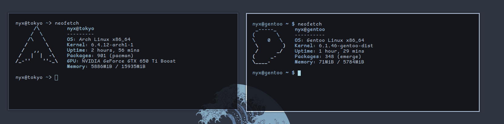

 **st - the simple (suckless) terminal**
 
## Installation
```
git clone https://github.com/essriee/ST
cd st
sudo make install
```
to get font support Install [Commic Shanns](https://github.com/shannpersand/comic-shanns)


## Dependencies

```
# Void
xbps-install libXft-devel libX11-devel harfbuzz-devel libXext-devel libXrender-devel libXinerama-devel

# Debian (and ubuntu probably)
apt install build-essential libxft-dev libharfbuzz-dev

# Nix
nix develop github:siduck/st

(most of these are already installed on Arch based distros)

# Install font-symbola and libXft-bgra
```



